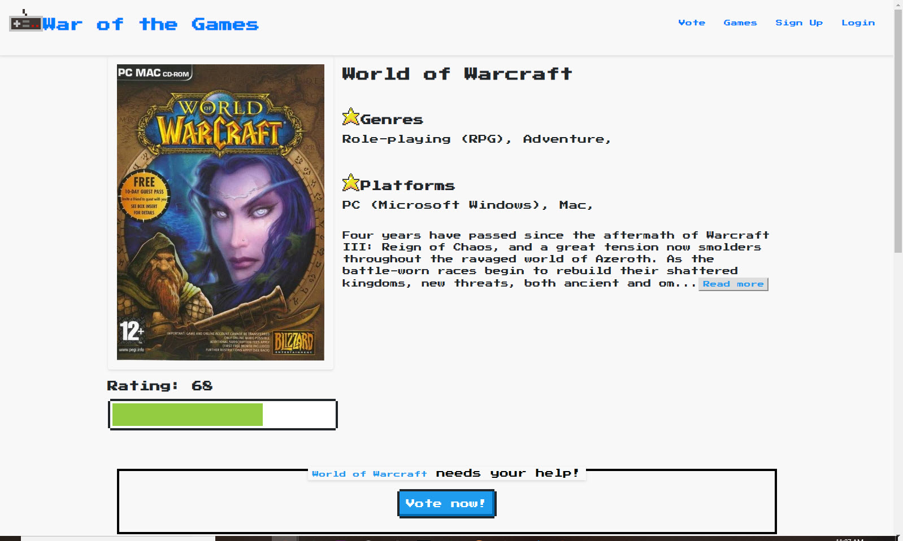
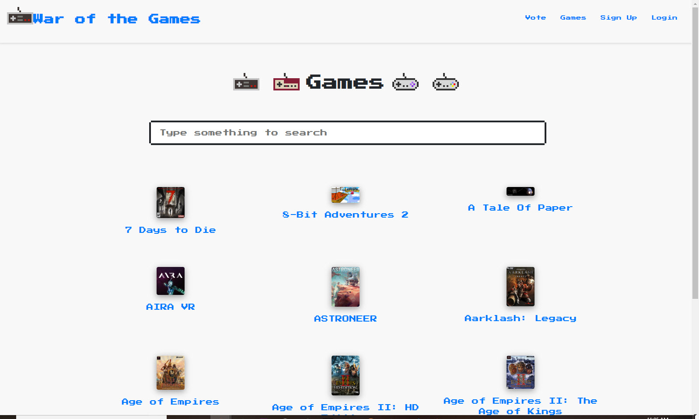

# War of the Games

[Kittenwar](http://www.kittenwar.com/) for video games. Pits two randomly selected video games against each other in an effort to determine, once and for all, which game is the best. Users will receive new game recommendations based on their ranking history.

- Front End: https://www.warofthegames.com/
- Back End: https://async-capstone.herokuapp.com/

## Features

- A new, randomly-generated battle with every refresh of the app.
- Skip button for matchups where users are either unfamiliar with one of the games or don't have a preference for one game over the other.
- Learn more about each game with individual info pages.
- User accounts to save ranking history.
- See all games in the database through the games list.
- Game recommendations coming soon!

## The Stack

### Client

- [React](https://reactjs.org/)
- [Redux](https://redux.js.org/) for state management
- [React Router](https://reacttraining.com/react-router/) for routing
- [Redux Form](https://redux-form.com/)

### Server

- [Node.js](https://nodejs.org/en/) with the [Express](https://expressjs.com/) framework.
- [MongoDB](https://www.mongodb.com/) with [Mongoose](https://mongoosejs.com/) for the database.
- [Passport](http://www.passportjs.org/) authentication using [node.bcrypt.js](https://github.com/kelektiv/node.bcrypt.js/) and [jsonwebtoken](https://github.com/auth0/node-jsonwebtoken).

## Screenshots

Homepage

Game info

Games list

## History

_War of the Games_ is the final capstone project for the _\*ASYNC_ team as part of [Thinkful's Engineering Immersion program](https://www.thinkful.com/bootcamp/web-development/full-time/).
